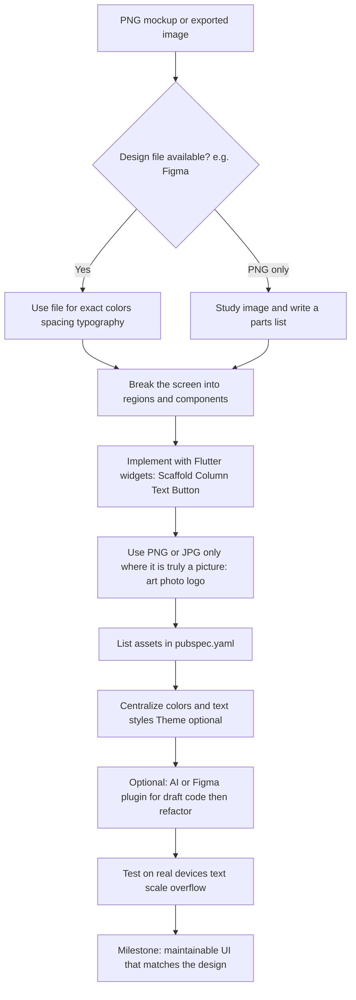

# From PNG mockups to Flutter UI: a developer-focused guide

## Flow at a glance

Read this chart **top to bottom**. It is the same path the rest of the article explains in words and code.



If your Markdown viewer does **not** draw Mermaid diagrams (some editors only show the code block), open this file on **GitHub** or use a [Mermaid Live Editor](https://mermaid.live) and paste the diagram.

---

## Table of contents

1. [Flow at a glance](#flow-at-a-glance)
2. [AI tools: from PNG to Flutter the easy way (and how long it takes)](#ai-tools-from-png-to-flutter-the-easy-way-and-how-long-it-takes)
   - [Example AI tool names (IDE, vision chat, design-to-code)](#example-ai-tool-names-ide-vision-chat-design-to-code)
3. [PNG, Figma export, and Flutter Image (read this first)](#png-figma-export-and-flutter-image-read-this-first)
   - [What a PNG is (in one minute)](#what-a-png-is-in-one-minute)
   - [What people mean by a Figma image](#what-people-mean-by-a-figma-image)
   - [What Flutter's `Image` widget is](#what-flutters-image-widget-is)
   - [Quick comparison table](#quick-comparison-table)
   - [PNG or JPEG vs Figma first: which path gives better Flutter output?](#png-or-jpeg-vs-figma-first-which-path-gives-better-flutter-output)
4. [Overview](#overview)
5. [Design basics (start here if you are new to design)](#design-basics-start-here-if-you-are-new-to-design)
   - [What is a mockup?](#what-is-a-mockup)
   - [What is a PNG file?](#what-is-a-png-file)
   - [PNG vs the real design file](#png-vs-the-real-design-file)
   - [A few words designers use (in plain English)](#a-few-words-designers-use-in-plain-english)
6. [Practical example: from your PNG to Flutter](#practical-example-from-your-png-to-flutter)
   - [Step 1: Turn the picture into a parts list](#step-1-turn-the-picture-into-a-parts-list)
   - [Step 2: Why a full-screen PNG is usually wrong](#step-2-why-a-full-screen-png-is-usually-wrong)
   - [Step 3: Rebuild one screen with widgets](#step-3-rebuild-one-screen-with-widgets)
   - [Step 4: Register image files in pubspec.yaml](#step-4-register-image-files-in-pubspecyaml)
   - [Pattern: row with a thumbnail PNG and text](#pattern-row-with-a-thumbnail-png-and-text)
7. [What “good output” means in Flutter](#what-good-output-actually-means-in-flutter)
8. [The reliable baseline: developer workflow](#the-reliable-baseline-developer-workflow-without-over-relying-on-automation)
9. [Using PNG assets correctly](#using-png-assets-correctly-without-faking-the-whole-ui)
10. [AI and semi-automated paths](#ai-and-semi-automated-paths-what-helps-today)
11. [A hybrid strategy](#a-hybrid-strategy-that-often-yields-the-best-results)
12. [Checklist before you call the screen done](#checklist-before-you-call-the-screen-done)
13. [Bottom line](#bottom-line)

---

## AI tools: from PNG to Flutter the easy way (and how long it takes)

**Can AI turn a PNG into Flutter UI easily?**  
Yes, compared to starting from a blank file—**if you treat AI as a fast draft tool**, not a finished app. Modern assistants (IDE copilots, chat tools with **image / vision**, and some **screenshot-to-code** products) can look at your mockup and emit a **first-pass** widget tree: `Scaffold`, `Column`, `Text`, `Container`, colors, and rough spacing.

**What becomes easy with AI**

- **Minutes (often ~5–20 minutes)** for a **simple screen**: you get readable Dart you can paste into a project and run, then fix errors.
- **Describing the screen** in words *while* attaching the PNG often improves the layout (e.g. “use `ListView`, brand green `#2E7D32`, safe area respected”).
- **Boilerplate**—repetitive `Padding`, `TextStyle`, `BoxDecoration`—is where models save the most typing.

**What still takes time (even with AI)**

AI does not know your app’s **routing, state management, API, or theme** unless you tell it. You still need to:

- Fix **overflow**, **keyboard**, and **different screen sizes**.
- Replace **magic numbers** with **theme** or constants.
- Wire **real data**, **navigation**, and **accessibility**.

That work is usually **hours**, not seconds—especially for **production** quality.

**Rough time table (order-of-magnitude, for one developer who already knows Flutter)**

| Goal | With strong AI assist (draft + you refactor) | Mostly manual from PNG |
|------|---------------------------------------------|-------------------------|
| **Simple static screen** (few sections, no lists/forms) | **~1–3 hours** to something shippable for an internal demo | **~3–6 hours** |
| **Typical product screen** (scroll, cards, one form, respects theme) | **~half day to 1 day** | **~1–2 days** |
| **Polished / responsive / accessible** (multiple breakpoints, large text, edge cases) | **~1–3 days** depending on design complexity | **~2–5 days** |

These ranges **exclude** backend, testing strategy, and app-wide architecture—they assume **UI-only** work.

**Honest takeaway**

- **“AI generated it in two minutes”** usually means **first draft in two minutes**; **merge-ready code** is almost always **longer**.
- Easiest path: **AI for the skeleton**, **you** for constraints, theme, and device testing—the same **hybrid** idea the rest of this guide expands on.

### Example AI tool names (IDE, vision chat, design-to-code)

Markets change quickly: **check each product’s site** for current **Flutter / Dart** support, pricing, and whether it accepts **image uploads** or works from **Figma** only.

**IDE and inline assistants** (describe layout, paste snippets, sometimes attach an image in the chat panel)

- **GitHub Copilot** (with Copilot Chat where available)
- **Cursor**
- **Amazon Q Developer**
- **JetBrains AI Assistant** (IntelliJ / Android Studio family)
- **Visual Studio IntelliCode** (completion-focused; pair with a vision chat for PNGs)
- **Codeium**
- **Tabnine**
- **Windsurf** (Codeium)

**Chat apps with vision** (upload your PNG; ask for Flutter / Dart)

- **ChatGPT** (OpenAI)
- **Claude** (Anthropic)
- **Google Gemini**
- **Microsoft Copilot** (consumer / Microsoft 365 where image input exists)

**Design-to-code and handoff** (often stronger when the source is **Figma**, not only a flat PNG)

- **Figma** (Dev Mode, inspect, variables; plus first-party or third-party codegen—verify export quality)
- **Locofy**
- **Anima**
- **TeleportHQ**
- **Builder.io**
- **DhiWise** (check current mobile / Flutter coverage)

**Screenshot-to-code style products** (useful for **HTML/CSS/React** prototypes; always ask if they can target **Flutter** or treat output as a **layout reference** only)

- **v0** (Vercel) — web UI focus; rarely Flutter-native
- **Replit** (agent-style coding from prompts)
- Various smaller **“screenshot to code”** startups (search the phrase—many are web-first)

For Flutter-specific **Figma → Dart** keywords, search for **Figma to Flutter plugin** or **Flutter code generation from Figma**; names and quality vary by month.

---

## PNG, Figma export, and Flutter Image (read this first)

These three phrases sound similar but they live in **different worlds**: **files**, **design tools**, and **your app code**. Clearing them up early saves confusion when someone says “use the Figma image in Flutter.”

### What a PNG is (in one minute)

**PNG** is a **file format** for a **bitmap** picture: a grid of pixels saved on disk (or attached in chat). Examples: `header.png`, `icon@2x.png`.

- It is **not** Flutter-specific. Anything can open or display a PNG (browsers, Figma, your phone gallery).
- It carries **pixels and transparency**, not editable text layers or button widgets.
- In Flutter you **might** show that file using the **`Image` widget** (see below), but the PNG itself is still just data stored as a file.

### What people mean by a Figma image

**Figma** is a **design application** on the web or desktop. People use “Figma image” in two different ways—listen for which one they mean:

1. **The Figma document (the real design)**  
   A **`.fig` project** (or a file open in Figma’s UI) with **frames**, **text objects**, **vector shapes**, **components**, and **inspectable** spacing and styles. This is **not** one PNG file. You **cannot** drop the whole Figma file into Flutter as a single replacement for building UI.

2. **A picture exported from Figma**  
   When someone clicks **Export** (e.g. PNG, JPG, SVG, PDF), Figma **rasterizes or saves** part of the design into a **normal image file**—often **PNG**. That exported PNG is then the **same kind of thing** as any other PNG on disk: flat pixels. Designers often export icons, illustrations, or whole frames as PNGs for handoff.

**Takeaway:** “Figma image” might mean **live design in Figma** (rich, editable) or **exported PNG/JPG from Figma** (flat, like any raster file). Only the second kind maps directly to **`Image.asset`** / **`Image.network`** after you add the file to your project.

### What Flutter's `Image` widget is

In Flutter, **`Image` is a widget**: a piece of UI **in your Dart code** that **displays** a picture. It is **not** a file format like PNG.

Common constructors:

| Constructor | Typical use |
|-------------|-------------|
| `Image.asset(...)` | Load a PNG/JPG (etc.) bundled in the app; path listed under `flutter: assets:` in `pubspec.yaml`. |
| `Image.network(...)` | Load a picture from a URL. |
| `Image.file(...)` | Load from device storage (path you have permission to read). |
| `Image.memory(...)` | Picture data already in memory (e.g. after download or decoding). |

Example (after declaring the asset):

```dart
Image.asset(
  'assets/images/logo.png',
  width: 120,
  fit: BoxFit.contain,
)
```

**Important:** The **`Image` widget shows** a picture. It does **not** replace building layout with **`Text`**, **`ElevatedButton`**, **`TextField`**, and so on unless your whole screen is *supposed* to be a static graphic.

### Quick comparison table

| | **PNG file** | **Figma (document vs export)** | **Flutter `Image` widget** |
|---|--------------|--------------------------------|----------------------------|
| **What is it?** | Image file on disk (bitmap). | **Doc:** editable design in Figma. **Export:** e.g. PNG/JPG/SVG from Figma. | Dart widget that **renders** image data inside your app. |
| **Lives where?** | Folder, email, cloud. | Figma cloud / app; exports in your `assets/` folder. | Inside your widget tree (`.dart` files). |
| **Contains editable text as text?** | No (text is painted pixels). | Yes in the **document**; **no** in a PNG export. | N/A (widget); you use separate **`Text`** widgets for real text. |
| **Use in Flutter** | Reference path via `Image.asset`, or open outside Flutter. | Use **document** for specs; use **exported** PNG like any other asset. | Use to **display** the bitmap (or use other widgets for UI chrome). |

### PNG or JPEG vs Figma first: which path gives better Flutter output?

You are choosing between two high-level workflows (with or without AI):

1. **Raster image (PNG / JPEG) → AI → Flutter** (vision model or screenshot-style tool writes Dart from pixels).
2. **Raster image → (optional) recreate or import into a Figma file → AI / plugins → Flutter** (structured frames, text layers, spacing).

**Short answer:** For **best output**—meaning **correct spacing and type**, **real text**, **reusable components**, and **easier refactors**—**a proper Figma document in the middle usually beats going straight from a flat image to Flutter**, especially for anything beyond a trivial screen. The cost is **extra time** rebuilding or cleaning the design in Figma (fully automatic “JPEG → perfect Figma” is rare).

| | **PNG / JPEG → Flutter (AI on the image)** | **Image → Figma design → Flutter (AI on structure)** |
|---|-------------------------------------------|------------------------------------------------------|
| **Typical strength** | Fast **first draft**; no design-tool setup. | **Inspectable** sizes, colors, typography; text stays **text** in design; better handoff to codegen or AI. |
| **Typical weakness** | Model **guesses** layout; hard to match **exact** dp/spacing; long labels and edge cases break more often. | Upfront **effort** to build or fix Figma; “auto image to Figma” tools often need **manual tidy-up**. |
| **Best when** | One-off screen, prototype, or you will **throw away** the first draft. | Ongoing product, **multiple screens**, or you care about **design–dev consistency**. |

**Using AI in each path**

- **Image → Flutter:** Best use of AI is **chunked prompts** + copy-pasted **theme values** (hex, font names) you read from the image; expect **refactor** time.
- **Image → Figma → Flutter:** AI can help **name layers**, suggest **auto layout**, or **draft** frames, but the win is that **you** (or plugins) work from **vectors and text nodes** afterward—codegen and prompts become **more accurate** than from a JPEG alone.

**Practical recommendation**

- Need something **quick and rough**? **PNG/JPEG + vision AI → Flutter** is fine—plan time to **fix** overflow and theme.
- Need **production-grade** UI that tracks a design system? **Invest in Figma** (even if the first step is **tracing** the mockup), then **Flutter + AI** on top of that structure usually produces the **better final result**.

---

## Overview

This guide is for **Flutter developers**—including people who are **new to design**—who receive **PNG images** (or similar) that show how an app screen should look, and need to **build that UI in code**.

**What you will learn:**

- A **flowchart** at the top of this page that shows the whole PNG → Flutter path in one view.
- **Up front:** how **AI tools** can speed up PNG → Flutter drafts and **rough time ranges** (minutes vs hours) before you dive deeper.
- **PNG vs Figma vs Flutter `Image`**: what each term actually means and how they differ (placed **early** so you can read it first).
- **Raster image straight to Flutter vs Figma-first**—which path tends to give **better** results when using AI.
- In simple terms: what a **mockup** and a **PNG** are, and why they are not enough by themselves to “auto-build” an app.
- What **good Flutter UI** looks like from an engineering perspective (not only “looks like the picture on my laptop”).
- A **step-by-step workflow** that professional teams use when implementing designs.
- How **AI tools** can help (and where they usually fall short) if you want to go from a picture toward Flutter widgets.
- A **practical Flutter example**: how to read a mockup and express it as real widgets (with sample Dart).
- A short **checklist** so you know when a screen is truly “done.”

**Mindset:** A PNG is like a **photograph of the design**. It shows the goal appearance, but it does not contain structured data that Flutter can import—no automatic “Import PNG → working app.” Your job is to **recreate** that look using **widgets**, **layout**, and **theme**, and to make it work on **different phones** and **accessibility settings**. That is normal; it is not a sign that you are doing it wrong.

---

## Design basics (start here if you are new to design)

If you have **zero background** in design files, this section gives you just enough vocabulary to read mockups, talk to designers, and choose the right workflow.

### What is a mockup?

A **mockup** (or **screen design**) is a **static picture** of what a screen should look like: where the title goes, colors, buttons, images, lists, and so on. Often it is created in a design tool, then **exported** so you receive a **PNG** (or JPG, PDF). Think: “the blueprint’s finished drawing,” not the blueprint’s editable layers.

### What is a PNG file?

**PNG** is an **image file format**, like JPG or GIF. It stores a **grid of colored pixels** (a **bitmap** or **raster** image).

- **Pros:** Supports transparency; common for UI screenshots and icons.
- **Cons for developers:** It is **flat**. You cannot “click” a button inside a PNG in a meaningful way in your app unless you build real widgets and place the PNG behind or beside them. Zooming in can look **blocky** if the image is low resolution.

So: **PNG = picture**. Your Flutter UI should usually be **built from widgets**, and PNGs used only where a **picture** is what you need (photos, illustrations, some icons).

*(For a side-by-side comparison of **PNG vs Figma vs Flutter `Image`**, see [the section above](#png-figma-export-and-flutter-image-read-this-first).)*

### PNG vs the real design file

Designers often work in tools such as **Figma**, **Sketch**, or **Adobe XD**. Those files contain:

- **Layers** (text as real text, shapes as vectors),
- **Spacing** you can measure,
- **Color and typography styles** you can copy,
- Sometimes **components** (reusable buttons, cards).

When they **export to PNG**, that richness is **flattened** into one image. You still *see* the design, but you **lose** easy access to exact measurements unless they share **specs**, a **link** to the design file, or a **design handoff**.

**Practical tip:** Whenever possible, ask for **Figma view access** (or equivalent) *in addition to* PNGs. PNG alone is workable; PNG + design file is much faster and more accurate.

### A few words designers use (in plain English)

| Term | Simple meaning |
|------|----------------|
| **Spacing / padding** | Empty space around or inside elements (e.g. “16 px between icon and text”). |
| **Margin** | Space *outside* a box; **padding** is space *inside* the box. |
| **Typography** | Font family, size, weight (bold/regular), line height, letter spacing. |
| **Hex color** | A code like `#336699` that identifies an exact color for code (`Color(0xFF336699)` in Flutter). |
| **Radius** | How rounded a card or button’s corners are. |
| **Elevation / shadow** | Depth effect under a card or FAB (Material design). |
| **Grid / alignment** | Things line up on an invisible grid so the screen looks orderly. |
| **Breakpoint** | Screen width where layout changes (e.g. phone vs tablet). |

You do not need to be a designer—you only need to **map** these ideas to Flutter: `EdgeInsets` for padding/margin, `TextStyle` for typography, `BoxDecoration` for radius and sometimes shadows, and `LayoutBuilder` or breakpoints for responsiveness.

---

## Practical example: from your PNG to Flutter

You have **one image** (the mockup). Flutter still needs **widgets**. Below is a concrete way to go from “I see a picture” to “I have code,” using a simple welcome-style screen as the story.

### Step 1: Turn the picture into a parts list

Before typing code, **name the pieces** you see. Example: your PNG looks roughly like this (ASCII sketch):

```text
+------------------------------------------+
|  My App                          (top)   |
+------------------------------------------+
|                                          |
|  Welcome back          <- big title      |
|  Sign in to continue     <- smaller line  |
|                                          |
|  [ illustration from designer PNG ]      |
|                                          |
|        [ Sign in ]       <- green button  |
|                                          |
+------------------------------------------+
```

Your **parts list** might be:

| # | What you see | Flutter building block |
|---|----------------|-------------------------|
| 1 | Bar at top with title | `AppBar` (inside `Scaffold`) |
| 2 | Big title + gray subtitle | `Text` + `Text` in a `Column` |
| 3 | Art / photo under the text | `Image.asset` (your PNG file lives here) |
| 4 | Primary action | `ElevatedButton` or `FilledButton` |
| 5 | Space between items | `SizedBox` or `Padding` / `EdgeInsets` |

**Mapping colors:** If the design says green `#2E7D32`, use `Color(0xFF2E7D32)` (drop the `#`, add `0xFF` in front).

### Step 2: Why a full-screen PNG is usually wrong

It is tempting to do this:

```dart
// Anti-pattern for real apps: entire screen is one flat image.
// Text is not selectable, accessibility is poor, layout won't adapt.
body: Image.asset(
  'assets/images/whole_screen_mockup.png',
  fit: BoxFit.cover,
),
```

That can **look** like the mockup on one device, but it is not a real UI: buttons are not buttons, text is not `Text`, and small screens or large fonts will hurt you. **Use the PNG only for the parts that are truly pictures** (illustration, photo, logo raster).

### Step 3: Rebuild one screen with widgets

This sample matches the rough layout above: **structure + real text + one illustration PNG + a tappable button**. Adjust colors and sizes to match your file.

```dart
import 'package:flutter/material.dart';

class WelcomeFromMockupScreen extends StatelessWidget {
  const WelcomeFromMockupScreen({super.key});

  /// From design hex #2E7D32 → Flutter
  static const _primaryGreen = Color(0xFF2E7D32);

  @override
  Widget build(BuildContext context) {
    return Scaffold(
      appBar: AppBar(
        title: const Text('My App'),
        backgroundColor: Colors.white,
        foregroundColor: Colors.black87,
        elevation: 0,
      ),
      body: SingleChildScrollView(
        padding: const EdgeInsets.all(24),
        child: Column(
          crossAxisAlignment: CrossAxisAlignment.stretch,
          children: [
            const Text(
              'Welcome back',
              style: TextStyle(
                fontSize: 28,
                fontWeight: FontWeight.bold,
                color: Colors.black87,
              ),
            ),
            const SizedBox(height: 8),
            Text(
              'Sign in to continue',
              style: TextStyle(
                fontSize: 16,
                color: Colors.grey.shade600,
              ),
            ),
            const SizedBox(height: 24),
            ClipRRect(
              borderRadius: BorderRadius.circular(12),
              child: AspectRatio(
                aspectRatio: 16 / 9,
                child: Image.asset(
                  'assets/images/welcome_illustration.png',
                  fit: BoxFit.cover,
                ),
              ),
            ),
            const SizedBox(height: 32),
            ElevatedButton(
              onPressed: () {
                // Navigate or validate — real app logic here
              },
              style: ElevatedButton.styleFrom(
                backgroundColor: _primaryGreen,
                foregroundColor: Colors.white,
                padding: const EdgeInsets.symmetric(vertical: 16),
                shape: RoundedRectangleBorder(
                  borderRadius: BorderRadius.circular(8),
                ),
              ),
              child: const Text('Sign in'),
            ),
          ],
        ),
      ),
    );
  }
}
```

**What this shows in practice:**

- The **mockup’s words** become `Text` widgets (translation and accessibility work normally).
- The **illustration** stays a PNG via `Image.asset`.
- **Spacing** (`SizedBox`, `padding`) is how you copy “16 px gap” from the design.
- `SingleChildScrollView` avoids overflow when the keyboard opens or text is large.

Later you can replace hard-coded `TextStyle` with `Theme.of(context).textTheme` so the whole app stays consistent.

### Step 4: Register image files in pubspec.yaml

Put your PNG under something like `assets/images/`. Flutter only loads it if you declare it:

```yaml
flutter:
  assets:
    - assets/images/welcome_illustration.png
```

After editing `pubspec.yaml`, run `flutter pub get`. The path string in `Image.asset(...)` must match.

### Pattern: row with a thumbnail PNG and text

Many lists in mockups look like: **small square image | title + subtitle**. That maps directly to a `Row`:

```dart
Row(
  crossAxisAlignment: CrossAxisAlignment.start,
  children: [
    ClipRRect(
      borderRadius: BorderRadius.circular(8),
      child: Image.asset(
        'assets/images/thumbnail.png',
        width: 56,
        height: 56,
        fit: BoxFit.cover,
      ),
    ),
    const SizedBox(width: 16),
    Expanded(
      child: Column(
        crossAxisAlignment: CrossAxisAlignment.start,
        children: [
          Text(
            'Item title',
            style: Theme.of(context).textTheme.titleMedium,
          ),
          const SizedBox(height: 4),
          Text(
            'Supporting line from the design',
            style: Theme.of(context).textTheme.bodySmall?.copyWith(
                  color: Colors.grey.shade600,
                ),
          ),
        ],
      ),
    ),
  ],
)
```

`Expanded` stops long titles from overflowing sideways; for long lists, wrap rows in `ListView.builder`.

---

## What “good output” actually means in Flutter

Looking identical on **one** simulator is not enough. Strong output usually includes:

- **Layout fidelity**: spacing, alignment, hierarchy, and proportions match the design within an agreed tolerance (often ±1–2 logical pixels after rounding).
- **Responsive behavior**: the UI behaves correctly on small phones, large phones, tablets, and when the user changes **text scale** or uses **large fonts**.
- **Real widgets**: text is `Text`, buttons are tappable `Material`/`Cupertino` or custom widgets—not a single full-screen raster image pretending to be the UI.
- **Theme and tokens**: colors, typography, and radii come from `ThemeData` or a small design system layer so the app stays consistent as screens are added.
- **Accessibility**: screen readers, contrast, and touch targets matter—not optional polish.

PNG files **do not** encode vectors, constraints, or component structure. They are a **visual reference**, not a source of truth. Treat them that way and you avoid dead ends.

---

## The reliable baseline: developer workflow without over-relying on automation

Most professional teams still anchor on this pattern:

1. **Get vectors or specs when possible**  
   If the design exists in **Figma**, **Sketch**, or **Adobe XD**, prefer exporting specs from there (spacing, type styles, effects). PNG is a fallback for **looks**, not for **measurement**.

2. **Inventory the screen**  
   Break the mockup into regions: app bar, lists, cards, bottom navigation, overlays. Name components you will reuse across the app.

3. **Implement structure first**  
   Scaffold with `Scaffold`, then `Column` / `Row` / `Stack`, then drop in placeholders. Match **big blocks** before obsessing over shadows.

4. **Lock typography and color**  
   Define `TextTheme` and a color palette (or use `ColorScheme.fromSeed` and override where the brand requires). Paste hex values from the design; verify **light vs dark** if both ship.

5. **Replace placeholders with real content**  
   Use `ListView.builder`, `Wrap`, `Flexible`, and `Expanded` so the layout **survives** long strings and different layouts.

6. **Validate on devices**  
   Run on a small Android phone, a notched iPhone, and at least one tablet or split-screen configuration. Check **text scale 1.3+** in settings.

This path is what “perfect output” usually refers to in code review: **correct** and **maintainable**, not merely a screenshot overlay that matches on one device.

---

## Using PNG assets correctly (without faking the whole UI)

PNGs still belong in Flutter for **non-layout** visuals:

- Photos, illustrations, mascots, complex marketing art.
- Icons when you do not have SVG and accept fixed-size raster tradeoffs.

**Avoid** shipping entire screens as one large PNG for interactive flows: you lose semantics, scaling, accessibility, and easy iteration.

When you must use raster art:

- Provide **1x / 2x / 3x** (`assets/images/foo.png`, `foo@2x.png`, `foo@3x.png`) or use resolution-aware pipelines.
- Prefer **SVG** for icons and simple shapes when feasible (community packages can help, depending on your stack).

---

## AI and semi-automated paths: what helps today

There is no single “drop PNG, get production Flutter” button that reliably yields **perfect** results for all apps. What exists is a **spectrum of assistants**: some generate a rough widget tree, others help you refactor toward production quality.

### 1. Coding assistants in the IDE (e.g. Copilot-class tools)

**How it helps:** You describe the layout, reference **colors and spacing**, and sometimes attach the **PNG**. The model suggests `Widget` trees, `ThemeData` snippets, or `CustomPaint`/`BoxDecoration` code.

**Developer reality:** Treat output as a **draft**. You still need **constraints**, **overflow handling**, and **state management** consistent with your app.

**Best practice:** Ask for **small, reviewable** chunks (e.g. “app bar + first card”) instead of an entire screen in one shot.

### 2. Chat UIs with vision (image + instructions)

**How it helps:** Upload the PNG and request Flutter/Dart code for a specific section.

**Risk:** Models may hallucinate package APIs, ignore safe areas, or hard-code sizes that break on other devices.

**Mitigation:** Pin **Flutter SDK version**, forbid mystery packages unless you approve them, and ask for **`LayoutBuilder` / `MediaQuery`** when you need responsive behavior.

### 3. Design-tool integrations and export plugins

**Examples of the idea (names change over time):** Figma-centric workflows, “design to code” exporters, and community **Figma → Flutter** plugins.

**Strength:** When the source is **Figma**, exporters can sometimes produce **more structured** output than from a flat PNG—especially for frames, auto-layout, and text nodes.

**Weakness:** Generated code is often verbose or not aligned with your architecture (state, routing, DI). Plan time to **refactor** into your patterns.

### 4. Dedicated screenshot-to-code products

Some SaaS tools advertise **screenshot → HTML/React** or similar; a few mention mobile or allow custom prompts for Flutter.

**Use them for:** A **starting skeleton** or rapid prototype.

**Do not expect:** Drop-in production code with your navigation, theming, localization, and error states without human editing.

### 5. Optional: tracing for illustration-heavy UI

For illustrations that are hard to rebuild with widgets, teams sometimes use **vector tracing** (outside Flutter) to get SVG paths, then tune manually. That is art pipeline work, not general UI automation.

---

## A hybrid strategy that often yields the best results

Combine the reliability of **hand-built layout** with the speed of **AI drafts**:

1. Use AI or an exporter to produce a **first-pass** widget tree from PNG/Figma.
2. Immediately **strip** redundant `Container`s, fix **magic numbers** into **named constants** or theme extensions.
3. Insert **real data models** and loading/error UI.
4. Run **golden tests** or screenshot tests if your team uses them—this catches regressions when you iterate.
5. Do a final pass for **semantics** (`Semantics`, labels) if you care about accessibility compliance.

That sequence usually beats “pure AI” or “pure manual” for **velocity × quality**.

---

## Checklist before you call the screen done

- [ ] No overflow errors on small width; scrollables used where lists grow.
- [ ] Text scale and large fonts do not clip critical content.
- [ ] Tap targets meet platform guidance; contrast is acceptable.
- [ ] Colors and typography centralized (not scattered literals).
- [ ] Assets are resolution-ready; no blurry icons on dense displays.
- [ ] Dark mode (if in scope) reviewed against design or sensible defaults.

---

## Bottom line

- **PNG → Flutter** is fundamentally a **re-implementation problem**: your reference is visual, not structural.
- **Best output** comes from **spec-backed, widget-based builds**, **theming**, and **multi-device validation**.
- **AI tools** can **accelerate drafting** and boilerplate, but **engineering judgment** (constraints, architecture, accessibility) remains non-negotiable for production apps.

If you can move the workflow upstream—**Figma (or similar) as source of truth** plus a disciplined Flutter theme—you will spend less time reverse-engineering PNGs and more time shipping features.
